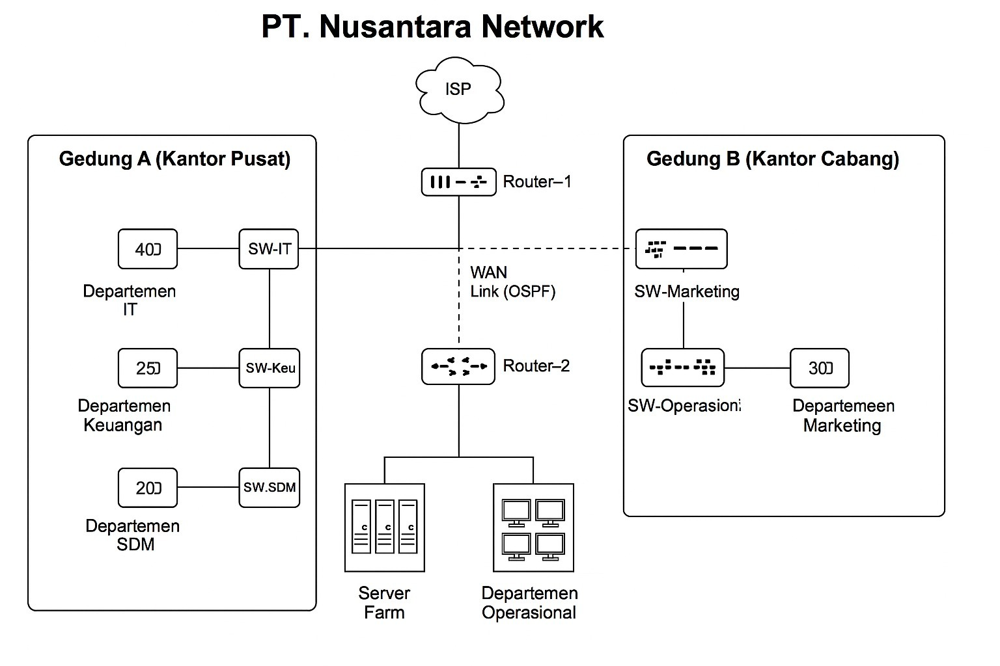

# Laporan Topologi Jaringan PT. Nusantara Network 

**KELOMPOK DMJK B 10** 
**(M Irgie Yanuar-Network Architect, Noviansyah-Network Engineer, Desnita-Network Services Specialist, Zaidan-Security & Documentation Specialist)** 

## 1. Gedung A (Kantor Pusat)

Terdapat beberapa departemen yang terhubung dengan switch masing-masing:

- **Departemen IT**  
  - Jumlah user: 40  
  - Terhubung ke: SWITCH-IT

- **Departemen Keuangan**  
  - Jumlah user: 25  
  - Terhubung ke: SWITCH-Keuangan

- **Departemen SDM**  
  - Jumlah user: 20  
  - Terhubung ke: SWITCH-SDM

Setiap switch departemen dihubungkan ke **Router-2**, yang juga terhubung ke:

- **Server Farm**  
  Menyediakan layanan dan aplikasi untuk pengguna internal.

- **Departemen Operasional**  
  Memiliki sejumlah komputer/terminal kerja yang langsung terhubung ke jaringan kantor pusat.

---

## 2. Koneksi Internet & Antar Gedung

- **Router-1** terhubung langsung ke **ISP (Internet Service Provider)** untuk akses internet.
- **Router-1** dan **Router-2** saling terhubung melalui **WAN Link** dengan menggunakan protokol **OSPF (Open Shortest Path First)**.
  - OSPF adalah protokol routing dinamis yang memungkinkan pemilihan rute terbaik antar jaringan.

---

## 3. Gedung B (Kantor Cabang)

Memiliki struktur jaringan yang lebih kecil:

- **SWITCH-Marketing** terhubung ke **SWITCH-Operasional**
- **SWITCH-Operasional** terhubung ke **Departemen Marketing**
  - Jumlah user: 30

Gedung B terhubung ke jaringan kantor pusat melalui **WAN Link (Router-1 ↔ Router-2)**.

---

## 4. Kesimpulan Alur Jaringan

- Setiap departemen dihubungkan melalui switch masing-masing.
- **Router-2** menjadi penghubung utama untuk seluruh perangkat di kantor pusat, server farm, dan akses ke jaringan luar.
- **Router-1** berperan sebagai penghubung ke ISP sekaligus penghubung antar gedung (kantor pusat dan cabang) melalui WAN Link.
- Protokol OSPF digunakan sebagai routing dinamis antar router.
