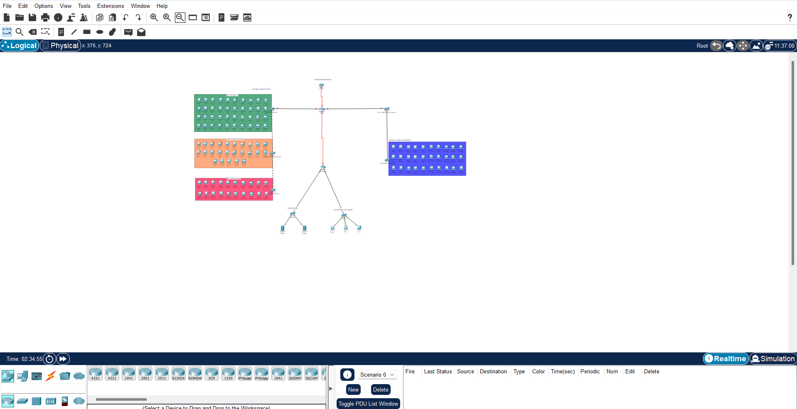

# [Proyek Perancangan & Implementasi Jaringan Enterprise PT. Nusantara Network] - [Pekan 10: Desain Topologi & Skema Pengalamatan] 
## Anggota Kelompok dan Peran 
- **Muhammad Irgie Yanuar (10221022)** - Network Architect  
- **Noviansyah(10231072)** - Network Engineer  
- **Desnita Dwi Putri (10231030)** - Network Services Specialist  
- **Zaidan Ramadhan Arrazy (10221028)** - Security & Documentation Specialist   
## Daftar Isi 
1. [Pendahuluan](#pendahuluan)  
2. [Isi Laporan](#isi-laporan)    
1. [Kendala dan Solusi](#kendala-dan-solusi)  
2. [Kesimpulan](#kesimpulan)  
## **Pendahuluan**  

### **Latar Belakang**  
PT. Nusantara Network merupakan perusahaan di bidang teknologi informasi yang memiliki dua lokasi kantor (pusat dan cabang) dengan total 6 departemen dan server farm. Perusahaan membutuhkan infrastruktur jaringan yang aman, terkelola dengan baik, dan mampu mendukung pertumbuhan bisnis di masa depan. Proyek ini bertujuan untuk merancang solusi jaringan enterprise yang mengintegrasikan seluruh konsep jaringan komputer yang telah dipelajari.

### **Tujuan**  
1. Merancang topologi jaringan yang memenuhi kebutuhan bisnis PT. Nusantara Network  
2. Mengimplementasikan segmentasi jaringan menggunakan VLAN  
3. Menyediakan konektivitas antar-gedung melalui WAN dengan routing dinamis (OSPF)  
4. Menerapkan layanan jaringan (DHCP, DNS, NAT) dan keamanan (ACL)  
5. Membangun dokumentasi teknis yang komprehensif  

### **Ruang Lingkup**  
Proyek mencakup:  
- Perancangan topologi fisik dan logis  
- Pembagian subnet dan pengalamatan IP  
- Konfigurasi VLAN, trunking, dan routing antar-VLAN  
- Implementasi OSPF untuk koneksi WAN antar-gedung  
- Penyediaan layanan DHCP, DNS, dan NAT  
- Penerapan Access Control List (ACL)  
- Pengujian end-to-end dan troubleshooting  
 
## Isi Laporan

## Diagram topologi fisik dan logis

#### Router Utama

##### Fungsi dan Peran:
- Router utama adalah komponen inti dari jaringan ini.
- Bertugas melakukan **routing antar VLAN** dan antar **gedung** (A dan B).
- Terhubung langsung ke **cloud** sebagai representasi dari **akses internet** perusahaan.
- Menghubungkan ke **switch layer 2** yang menyambungkan ke seluruh departemen.

Router ini sangat penting karena berfungsi sebagai titik pusat komunikasi antar semua segmen jaringan. Routing antar VLAN dapat dikontrol menggunakan Access Control List (ACL) untuk menentukan siapa yang bisa mengakses apa.

#### Gedung A (Kantor Pusat)

Gedung A menjadi pusat utama pengelolaan sistem dan data internal. Memiliki beberapa departemen yang dipisahkan oleh VLAN untuk keamanan dan efisiensi jaringan.

##### a. Departemen IT
- **VLAN:** 10
- **Perangkat:** 
  - 40 PC (PC-PT 1 sampai PC-PT 40)
  - Terhubung ke satu switch Cisco 2960-24TT
- **Fungsi:**
  - Menjadi jaringan utama pengembangan sistem IT internal.
  - Digunakan untuk pengembangan aplikasi, pengujian, pemrograman, serta pengelolaan sistem backend seperti server atau database.
  
Karena bersifat teknis, departemen ini membutuhkan koneksi stabil, cepat, dan bebas gangguan untuk mendukung proses development.

##### b. Departemen Keuangan
- **VLAN:** 20
- **Perangkat:**
  - 25 PC (K1 sampai K25)
  - Terhubung ke switch khusus VLAN 20
- **Fungsi:**
  - Fokus pada transaksi dan pengelolaan sistem keuangan.
  - Kemungkinan besar terhubung ke server ERP atau database keuangan.
  
Isolasi melalui VLAN sangat penting di sini karena informasi yang ditangani bersifat sensitif dan harus dijaga privasinya.

##### c. Departemen SDM
- **VLAN:** 30
- **Perangkat:**
  - 20 PC (SDM1 sampai SDM20)
  - Terhubung ke switch VLAN 30
- **Fungsi:**
  - Digunakan untuk manajemen data karyawan, absensi, rekrutmen, dan aktivitas administratif SDM lainnya.
  
Departemen ini sering menangani data pribadi, sehingga perlu pembatasan akses dan perlindungan jaringan yang baik.

##### d. Server Farm
- **Terdiri dari:**
  - 1 Switch Cisco
  - 2 Server (Server0 dan Server1)
- **Koneksi:**
  - Terhubung langsung ke router utama
- **Fungsi:**
  - Sebagai pusat layanan dan sumber daya jaringan internal:
    - File server
    - Database server
    - Aplikasi intranet
    - Domain Controller (DC)
- **Keunggulan:**
  - Karena terhubung langsung ke router, server dapat melayani berbagai VLAN sekaligus, tergantung konfigurasi ACL dan routing antar VLAN.

Server farm ini adalah jantung dari jaringan internal yang memungkinkan tiap departemen bekerja dengan sistem terpusat.

#### Gedung B (Kantor Cadangan)

Gedung B memiliki dua departemen besar yang berfokus pada operasional dan pemasaran.

##### a. Departemen Marketing
- **VLAN:** 40
- **Perangkat:**
  - Jumlah tidak disebutkan, tetapi tergolong banyak.
  - Diwakili dalam topologi dengan warna biru untuk menunjukkan keseragaman VLAN.
  - Terhubung ke switch VLAN 40 yang menuju router utama.
- **Fungsi:**
  - Aktivitas pemasaran, pengumpulan data pasar, komunikasi eksternal, dan kampanye digital.
  
Penggunaan VLAN memungkinkan departemen ini beroperasi secara mandiri tanpa mengganggu lalu lintas jaringan internal lainnya.

##### b. Departemen Operasional
- **VLAN:** 50
- **Perangkat:**
  - Banyak PC dengan label kompleks (contoh: PC6(1), PC4(1)(2), dll.)
  - Terhubung ke switch VLAN 50
- **Fungsi:**
  - Digunakan untuk aktivitas utama perusahaan seperti:
    - Entri data produksi
    - Pelayanan pelanggan
    - Pemantauan proses operasional
- **Catatan:**
  - Karena kepadatan perangkat yang tinggi, VLAN ini berpotensi mengalami beban lalu lintas tinggi.
  - Diperlukan konfigurasi **bandwidth management** untuk menjaga performa dan stabilitas jaringan.

#### Departemen Operasional (Tambahan di Bawah Router)

- **Perangkat:**
  - 3 PC: PC0, PC1, dan PC2
  - Terhubung ke switch kecil yang langsung tersambung ke router utama.
- **Fungsi:**
  - Kemungkinan merupakan tim **admin jaringan** atau **helpdesk**.
  - Bertugas untuk:
    - Monitoring jaringan
    - Pemeliharaan sistem harian
    - Troubleshooting perangkat dan koneksi.

Karena berada langsung di bawah router, perangkat ini memiliki akses cepat ke semua VLAN dan server.

#### Kesimpulan

Struktur jaringan PT Nusantara Network dirancang dengan memperhatikan:
- **Segmentasi VLAN** untuk keamanan dan efisiensi.
- **Routing pusat** yang fleksibel dan scalable.
- **Penggunaan switch Layer 2 dan routing Layer 3** untuk pemisahan logis dan pengaturan lalu lintas.
- **Server farm terpusat** untuk mempermudah pengelolaan layanan internal.
- **Bandwidth management dan ACL** sebagai upaya menjaga performa dan keamanan.

Struktur ini mencerminkan sistem jaringan perusahaan modern yang terorganisasi dan siap berkembang.

## Tabel pengalamatan IP (subnet, VLAN ID, gateway, range, dsb). 

| Departemen   | VLAN ID | Jumlah Host | Network Address     | Subnet Mask            | Gateway         | Usable IP Range                    | Broadcast Address   |
|--------------|---------|-------------|----------------------|--------------------------|------------------|-------------------------------------|----------------------|
| IT           | 10      | 40          | 192.168.10.0/26       | 255.255.255.192 (/26)    | 192.168.10.1     | 192.168.10.2 – 192.168.10.62        | 192.168.10.63        |
| Keuangan     | 20      | 25          | 192.168.10.64/27      | 255.255.255.224 (/27)    | 192.168.10.65    | 192.168.10.66 – 192.168.10.94       | 192.168.10.95        |
| SDM          | 30      | 20          | 192.168.10.96/27      | 255.255.255.224 (/27)    | 192.168.10.97    | 192.168.10.98 – 192.168.10.126      | 192.168.10.127       |
| Marketing    | 40      | 20          | 192.168.10.128/27     | 255.255.255.224 (/27)    | 192.168.10.129   | 192.168.10.130 – 192.168.10.158     | 192.168.10.159       |
| Operasional  | 50      | 40          | 192.168.10.160/26     | 255.255.255.192 (/26)    | 192.168.10.161   | 192.168.10.162 – 192.168.10.222     | 192.168.10.223       |
| Server Farm  | -       | 2 server    | 192.168.10.224/29     | 255.255.255.248 (/29)    | 192.168.10.225   | 192.168.10.226 – 192.168.10.230     | 192.168.10.231       |

## Daftar perangkat yang dibutuhkan (router, switch, server, dsb). 

| No. | Jenis Perangkat    | Nama/Label di Topologi | Jumlah | Lokasi                                                                 |
|-----|--------------------|-------------------------|--------|------------------------------------------------------------------------|
| 1   | Router             | Router-PT               | 2      | 1 di pusat jaringan (inter-VLAN routing), 1 ke Server Farm             |
| 2   | Switch             | 2960-24TT               | 7      | 1 di Departemen IT, 1 Keuangan, 1 SDM, 1 Marketing, 1 Operasional, 1 Server Farm, 1 Pusat |
| 3   | PC / Client        | PC-PT                   | 125    | Departemen IT (40), Keuangan (25), SDM (20), Marketing (20), Operasional (40) |
| 4   | Server             | Server-PT               | 2      | Server Farm                                                            |
| 5   | Cloud / Internet   | Cloud-PT                | 1      | Paling atas, terkoneksi ke Router-PT pusat (PT Nusantara Network)     |

## Daftar perangkat yang dibutuhkan (router, switch, server, dsb). 

| No. | VLAN ID | Nama VLAN       | Fungsi / Tujuan Lebih Detail                                                                                                                                                       |
|-----|---------|------------------|-------------------------------------------------------------------------------------------------------------------------------------------------------------------------------------|
| 1   | 10      | VLAN_IT          | Mengelompokkan seluruh perangkat client milik Departemen IT. VLAN ini digunakan agar lalu lintas IT terpisah dari departemen lain, memungkinkan kontrol akses khusus dan isolasi jaringan untuk kebutuhan teknis (admin, development, support). |
| 2   | 20      | VLAN_KEUANGAN    | Mengelola jaringan perangkat Departemen Keuangan. Memberikan isolasi agar data transaksi dan akses ke server keuangan tidak bisa diakses sembarang user. Biasanya dikombinasikan dengan firewall atau ACL untuk mengontrol akses ke database keuangan. |
| 3   | 30      | VLAN_SDM         | Digunakan oleh Departemen Sumber Daya Manusia (SDM). Menyediakan segmentasi agar komunikasi dan akses data SDM (seperti data karyawan, gaji, absensi) tidak tercampur dengan lalu lintas VLAN lain. |
| 4   | 40      | VLAN_MARKETING   | Menyediakan jaringan khusus untuk Departemen Marketing. Memungkinkan pengaturan bandwidth khusus, pengamanan data riset pemasaran, serta kontrol akses ke aplikasi promosi atau CRM (Customer Relationship Management). |
| 5   | 50      | VLAN_OPERASIONAL | Mengelompokkan seluruh perangkat operasional (misalnya front office, gudang, layanan pelanggan). Dapat diatur memiliki akses terbatas ke aplikasi internal perusahaan sesuai kebutuhan operasional harian. |
| 6   | 99      | VLAN_SERVER      | VLAN khusus untuk Server Farm, berisi perangkat server penting (seperti database, web server, file server). VLAN ini digunakan untuk mengisolasi server dari broadcast VLAN lain, memungkinkan pengamanan jaringan yang lebih ketat dan kontrol penuh atas akses masuk/keluar ke server. Biasanya hanya dapat diakses oleh VLAN tertentu (misal IT/Admin). |

## **Kendala dan Solusi**  
Kendala: Mengatur waktu untuk mengerjakan laporan, karena terdapat tugas mata kuliah lain serta KKN.

Solusi: Membagi tugas tiap anggota kelompok agar lebih ringan.

## **Kesimpulan**  
Pada pekan ini telah dilakukan:  
1. Pembuatan diagram topologi fisik dan login.
2. Pembuatan tabel pengamatan IP.
3. Pembuatan daftar perangkat yang dibutuhkan.  
4. Membuat rencana penerapan VLAN.  
  
